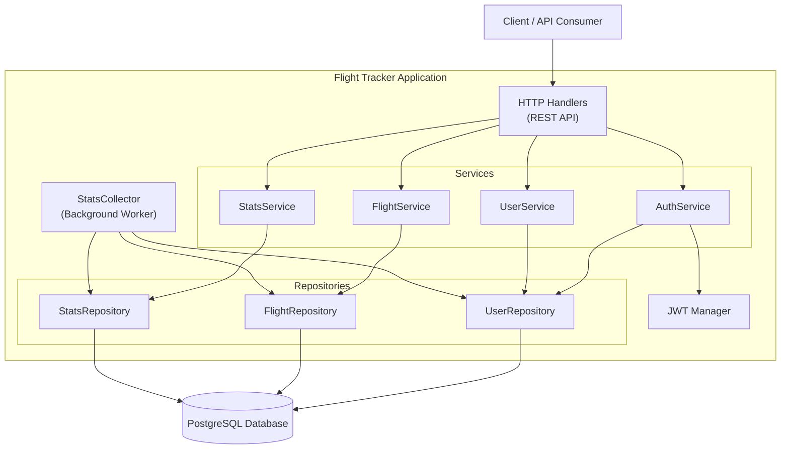

# **Сервис мониторинга статусов рейсов**

## **Описание домена**

Система мониторинга и управления статусами рейсов для авиакомпании или аэропорта. Сервис позволяет диспетчерам управлять статусами рейсов в реальном времени, а пассажирам — отслеживать статус своих рейсов.

### **Ключевые ограничения и предположения:**
Управление статусами рейсов:  
Допустимые переходы статусов рейсов: scheduled → check-in → boarding → departed → arrived  
Отмена возможна только из статусов: scheduled, check-in, boarding  
Рейс в статусе canceled не может менять свой статус  
Фактическое время вылета устанавливается автоматически при переходе в статус departed  
Фактическое время прилета устанавливается автоматически при переходе в статус arrived  
После создания в рейсе может меняться только его статус  
Нельзя создать рейс в прошлом  

Управление пользователями:  
При регистрации пользователь получает роль passenger  
Администратор только меняет роли существующих пользователей, а не создает новых пользователей  
Администратор не может изменить собственную роль  
Логин пользователя уникален в системе  

Права доступа:  
Операции чтения доступны всем пользователям (включая незарегестрированных)  
Операции создания и изменения рейсов доступны только пользователям с ролями dispatcher и admin  
Изменение ролей пользователей доступно только администраторам  

## **Use cases**
1. Диспетчер создает рейс с базовой информацией
2. Диспетчер обновляет статус рейса
3. Пасажир ищет рейс по номеру и получает его данные 
4. Администратор повышат статус пассажира до диспетчера

## **Component diagram**

## **Описание эндпоинтов**
Аутентификация (публичные):  
POST /auth/register – регистрация нового пользователя  
POST /auth/login – аутентификация пользователя 

Рейсы (чтение; публичные):  
GET /flights – просмотр списка рейсов  
GET /flights/{id} – просмотр деталей рейса по id  

Рейсы (запись; защищенные – требуется роль dispatcher или admin):  
POST /flights – создание нового рейса  
PATCH /flights/{id}/status – обновление статуса рейса  

Администрирование (защищенные – требуется роль admin):  
GET /admin/users – просмотр списка пользователей  
GET /admin/users/{login} – просмотр пользователя по логину  
PATCH /admin/users/{login}/role – изменение роли пользователя

Статистика (публичные):  
GET /stats – просмотр статистики

Система (публичные):  
GET /health – проверка здоровья системы  

## **User stories**
1. As a незарегистрированный пользователь I want зарегистрироваться в системе so that получить доступ к функционалу
2. As a зарегистрированный пользователь I want аутентифицироваться в системе so that получить доступ к своему аккаунту и защищенным ресурсам
3. As a пользователь системы I want просматривать список доступных рейсов so that выбрать подходящий рейс для путешествия
4. As a пользователь системы I want просматривать детальную информацию о конкретном рейсе so that узнать подробности о деталях рейса
5. As a диспетчер I want создавать новые рейсы в системе so that пассажиры могли видеть доступные варианты для бронирования
6. As a диспетчер или администратор I want обновлять статус рейса so that пассажиры получали актуальную информацию о вылетах и прилетах
7. As a администратор системы I want просматривать список всех пользователей so that управлять учетными записями и контролировать активность в системе
8. As a администратор системы I want просматривать информацию о конкретном пользователе so that решать вопросы поддержки и анализировать активность пользователя
9. As a администратор системы I want изменять роли пользователей so that предоставлять сотрудникам необходимые права доступа к функциям системы
10. As a пользователь системы I want просматривать статистику системы so that понимать масштабы работы авиакомпании и общую активность
11. As a технический специалист или администратор I want проверять состояние здоровья системы so that оперативно реагировать на проблемы и обеспечивать бесперебойную работу сервиса

## **Таблица соответствия**

| Story ID | Краткое описание | Эндпоинты | Критерии приёмки (GWT) | Бизнес‑правила | Юнит‑тесты | Негативные кейсы |
| :---- | :---- | :---- | :---- | :---- | :---- | :---- |
| AUTH‑1 | Регистрация нового пользователя | POST /auth/register | Given незарегестрированный пользователь — When POST /auth/register — Then 201; пользователь с ролью passenger создан | Логин уникален | TestUserService_CreateUser, TestUserService_CreateUser_Duplicate | 409 пользователь с данным логином уже существует |
| AUTH‑2 | Аутентификация пользователя | POST /auth/login | Given пользователь неаутентифицирован — When POST /auth/login — Then 200; пользователь аутентифицирован |  | TestAuthService_Login, TestAuthService_Login_WrongPassword | 401 неверные данные для входа |
| FLIGHT‑1 | Просмотр списка рейсов | GET /flights | Given пользователь — When GET /flights — Then 200; возвращаются данные рейсов с пагинацией | Доступно всем пользователям; пагинация | TestFlightService_List | 400 невалидные параметры пагинации |
| FLIGHT‑2 | Просмтор деталей рейса по id | GET /flights/{id} | Given пользователь — When GET /flights/{id} — Then 200; возвращаются данные рейса | Доступно всем пользователям | TestFlightService_GetByID, TestFlightService_GetByID_NotFound | 404 рейс не найден |
| FLIGHT‑3 | Создание нового рейса | POST /flights | Given роль=admin или dispatcher — When POST /flights — Then 201; рейс создан | Только диспетчер или админ может создавать рейсы; нельзя создать рейс в прошлом| TestFlightService_CreateFlight | 403 недостаточно прав; 409 попытка создать рейс в прошлом |
| FLIGHT‑4 | Обновление статуса рейса | PATCH /flights/{id}/status | Given роль=admin или dispatcher — When PATCH /flights/{id}/status — Then 200; статус обновлен | Только диспетчер или админ может менять статус; допустимые переходы статусов | TestFlightService_UpdateStatus_InvalidTransition | 403 недостаточно прав; 404 рейс не найден; 409 недопустимый переход  |
| ADMIN‑1 | Просмотр списка пользователей | GET /admin/users | Given роль=admin — When GET /admin/users — Then 200; возвращиется список пользователей | Только админ может просматривать пользователей | TestUserService_ListUsers | 403 недостаточно прав |
| ADMIN‑2 | Просмотр пользователя по логину | GET /admin/users/{login} | Given роль=admin — GET /admin/users/{login} — Then 200; возвращаются данные пользователя | Только админ может просматривать данные пользователя | TestUserService_GetUserByLogin | 403 недостаточно прав; 404 нет пользователя |
| ADMIN‑3 | Изменение роли пользователя | PATCH /admin/users/{login}/role | Given роль=admin — When PATCH /admin/users/{login}/role — Then 200; роль изменена | Только админ может менять роли; нельзя изменить свою роль | TestUserService_ChangeRole_SelfModification | 403 недостаточно прав; 404 нет пользователя; 403 попытка изменить свою роль |
| STATS‑1 | Просмотр статистики | GET /stats | Given пользователь — When GET /stats — Then 200; возвращается последняя полученная статистика | Доступно всем | TestStatsService_GetLatest |  |
| SYSTEM‑1 | Проверка здоровья системы | GET /health | Given пользователь — When GET /health — Then 200 | Доступно всем |  |  |

## **Запуск**
make run  
В системе создан админ с логином admin паролем admin
